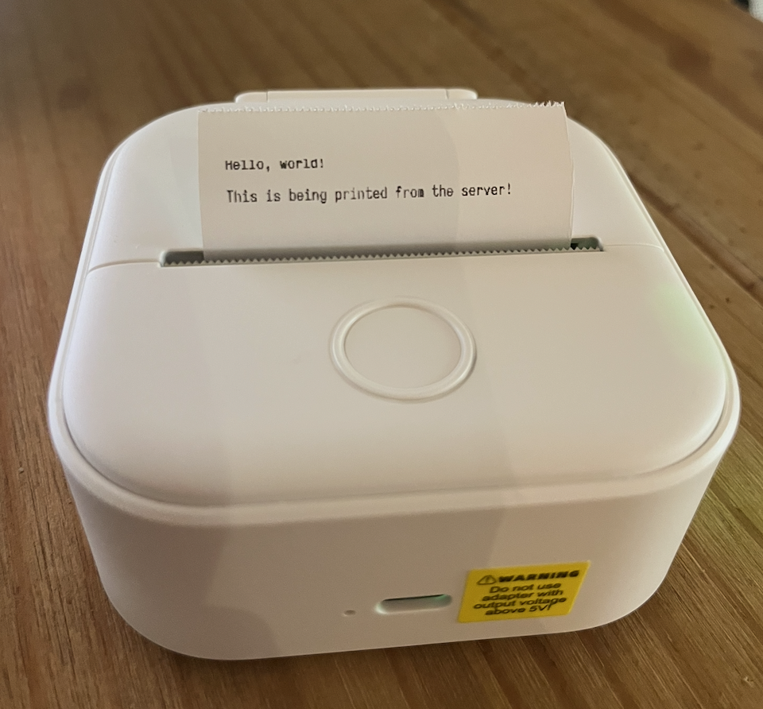

# gotenberg

This is an interface for Phonemo T02/M02 thermal laser printers.

The server is written in Go, and connects to the printer using Bluetooth Low Energy. The UI for controlling what gets printed (currently just text, hopefully more soon!) is exposed as a web interface on port 8080. The web interface does the job of rendering the data to draw to a bitmap, which is just POSTed to the server to print.

It's currently very rough around the edges but it does work. The entire thing was originally just in JavaScript including the bluetooth stuff, but that relies on the Bluetooth Low Energy web API which doesn't have very good adoption so I'm moving it to Go. I've also never used Go before so it's more of a project for myself than anything

## how to use

### 1. **Install Go**:
   - Ensure you have Go installed by running:
     ```
     go version
     ```

### 2. **Run the Application**

Follow these steps to run the application:

```sh
git clone https://github.com/tom-galvin/gotenburg.git
cd gotenburg
go mod tidy
go run .
```

### 3. **Open in browser**

Navigate to `localhost:8080` and you should see the UI appear!

## troubleshooting

- Ensure Bluetooth is enabled on your device & you have permission. On MacOS you may need to add your terminal emulator (e.g. iTerm2) to the allowed apps list for Bluetooth under **Privacy & Security** in system settings
- Ensure your device supports Bluetooth and has the required permissions enabled if you're having problems with bluetooth connectivity.
  This app uses the [TinyGo bluetooth](https://github.com/tinygo-org/bluetooth) library for Bluetooth Low Energy support, check their readme to make sure your machine (or whatever you intend to run the server on) is supported.

## why does it have that stupid name?

It's named after [this guy](https://en.wikipedia.org/wiki/Johannes_Gutenberg).

## features planned

* Use goroutines/channels rather than writing data on a different thread to the one which initialised the connection
* Handle connection dropouts
* Show battery/etc status in the frontend
* Better UI for printing
* Do less rendering work in the browser and move to the backend

## example



