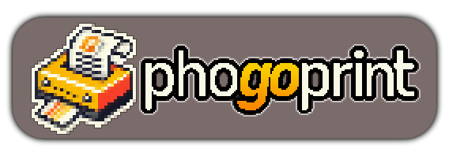

# phogoprint

<p align="center">
  
</p>

This is an interface for Phomemo T02/M02 thermal laser printers.

The server is written in Go, and connects to the printer using Bluetooth Low Energy. The UI for controlling what gets printed is exposed as a web interface on port 8080. The backend has a rendering engine to draw text and images (maybe more in the future) to a bitmap, converts it into the Phomemo bitmap format, and connects and writes the image to the printer. The functionality is exposed via a JSON API, and the tool currently exposes a very simple web interface to use the API. (More functionality will be added!)

It's currently very rough around the edges but it does work. The entire thing was originally just in JavaScript including the bluetooth stuff, but that relies on the Bluetooth Low Energy web API which doesn't have very good adoption so I've moved it to Go. I've also never used Go before so it's more of a project for myself than anything!

## how to use

### 1. **Install Go**:
   - Ensure you have Go installed by running:
     ```
     go version
     ```

### 2. **Run the Application**

Follow these steps to run the application:

```sh
git clone https://github.com/tom-galvin/phogoprint.git
cd phogoprint
go mod tidy
go run .
```

### 3. **Open in browser**

Navigate to `localhost:8080` and you should see the UI appear!

## troubleshooting

- Ensure Bluetooth is enabled on your device & you have permission. On MacOS you may need to add your terminal emulator (e.g. iTerm2) to the allowed apps list for Bluetooth under **Privacy & Security** in system settings
- Ensure your device supports Bluetooth and has the required permissions enabled if you're having problems with bluetooth connectivity.
  This app uses the [TinyGo bluetooth](https://github.com/tinygo-org/bluetooth) library for Bluetooth Low Energy support, check their readme to make sure your machine (or whatever you intend to run the server on) is supported.

## features planned

* Better UI
* Template designer
* Handle connection dropouts better

## example

A small template engine can be used to set up labels to print, which is exposed via the API.

### Create template

`PUT http://localhost:8080/api/template/5e2f55fe-8ebf-4683-8d6b-fe3feaebe653`
```json
{
  "name": "Test Template",
  "uuid": "5e2f55fe-8ebf-4683-8d6b-fe3feaebe653",
  "landscape": false,
  "minSize": 150,
  "texts": [
    {
      "text": "My Label",
      "position": { "x": 3, "y": 3 },
      "fontSize": 20,
      "fontUuid": "4d98c9b6-8bb5-492d-9789-a2bb5ea8ab21"
    },
    {
      "text": "Text: {text}",
      "position": { "x": 3, "y": 30 },
      "fontSize": 14,
      "fontUuid": "4d98c9b6-8bb5-492d-9789-a2bb5ea8ab21"
    },
  ],
  "parameters": [
    {
      "name": "text"
    }
  ]
}
```

### Print

`POST http://localhost:8080/api/template/5e2f55fe-8ebf-4683-8d6b-fe3feaebe653/print`
```json
{
  "parameterValues": [{"parameterName": "text", "value": "This is some text"}]
}
```

### Outcome


